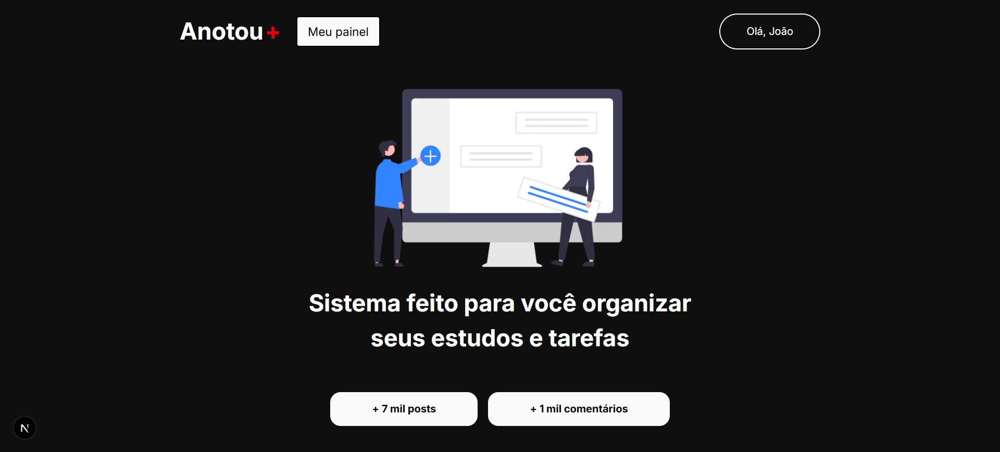
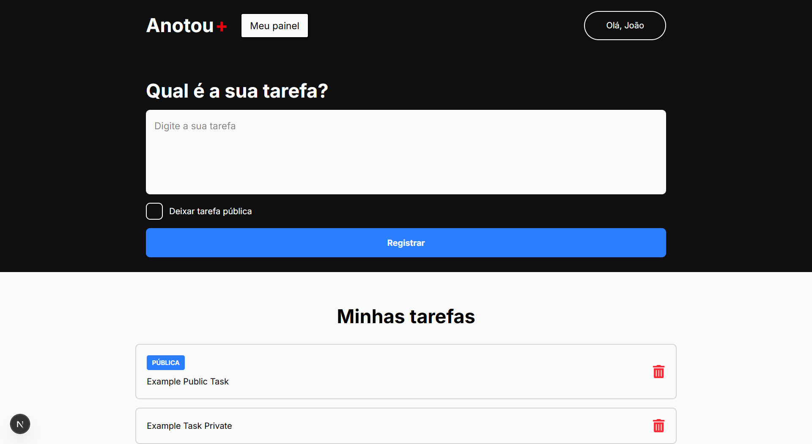

[PROJECT__URL]: 

<h1 align="center" style="font-weight: bold;">Anotou<span style="color:red;">+</span></h1>

<p align="center">
 <a href="#started">Getting Started</a> • 
  <a href="#routes">Application Routes</a> •
  <a href="#colab">Collaborators</a> •
 <a href="#contribute">Contribute</a> •
 <a href="#license">License</a>
</p>

<p align="center">
    <b>
    Anotou<span style="color:red;">+</span> is an enhanced to-do list application built with Next.js and Firebase. It allows users to create, manage, and share notes in a simple and interactive way.
    </b>
</p>

<p align="center">
     <a href="https://github.com/machadojoaovictor/anotou-plus">Visit this Project</a>
</p>

<p align="center">
    
    
    
</p>

<h2 id="started">🚀 Getting started</h2>

Instructions to run the project locally.

<h3>Technologies</h3>

This project was built using:

- **[Next.js 15](https://nextjs.org/)** – React framework for building fast, modern web applications
- **[TypeScript](https://www.typescriptlang.org/)** – Strongly typed programming language for safer code
- **[Firebase](https://firebase.google.com/)** – Authentication, Firestore database, and hosting
- **[Tailwind CSS 4](https://tailwindcss.com/)** – Utility-first CSS framework for rapid UI development
- **[React 19](https://react.dev/)** – Library for building user interfaces
- **[React Icons](https://react-icons.github.io/react-icons/)** – Popular icon pack for React
- **[PostCSS](https://postcss.org/)** – CSS processing and transformations
- **[clsx](https://github.com/lukeed/clsx)** – Utility for conditionally joining classNames

<h3>Prerequisites</h3>

Here you list all prerequisites necessary for running your project. For example:

- **Node.js** >= 18 (recommended: latest LTS version)
- **npm** >= 9 or **yarn** >= 1.22
- **Firebase** account with:
  - A project set up in the [Firebase Console](https://console.firebase.google.com/)
  - Google Authentication enabled
  - Firestore Database enabled
- `.env.local` and `.env.local` files containing your Firebase and AuthJS configuration keys

<h3>Cloning</h3>

How to clone your project

```bash
git clone https://github.com/machadojoaovictor/anotou-plus.git
```

<h3>Starting</h3>

How to start your project

```bash
cd anotou-plus
npm run dev
```

<h2 id="routes">📍 Application Routes</h2>

Below are the main routes of the application and their purpose:

| Route                 | Description                                                         |
| --------------------- | ------------------------------------------------------------------- |
| <kbd>/</kbd>          | Public landing/home page                                            |
| <kbd>/dashboard</kbd> | Page that lists all user tasks, info, and allows creating new tasks |
| <kbd>/task/[id]</kbd> | Task details page (requires login to comment)                       |

<h2 id="colab">🤝 Collaborators</h2>

A special thanks to everyone who contributed to this project.

<table>
  <tr>
    <td align="center">
      <a href="https://github.com/machadojoaovictor">
        <br>
        <sub>
          <b>João Victor Machado</b>
        </sub>
      </a>
    </td>
  </tr>
</table>

<h2 id="contribute">📫 Contribute</h2>

If you would like to contribute to **Anotou+**, follow these steps:

1. `git clone https://github.com/machadojoaovictor/anotou-plus.git`
2. `git checkout -b feature/NAME`
3. Follow the commit message patterns used in this project
4. Open a Pull Request describing the problem solved or feature added.  
   If applicable, please include screenshots of any visual changes.  
   Then wait for the review!

Thank you for helping improve <b style="color:black;">Anotou<span style="color:red;">+</span></b>

<h3>Documentations that might help</h3>

[📝 How to create a Pull Request](https://www.atlassian.com/br/git/tutorials/making-a-pull-request)

[💾 Commit pattern](https://gist.github.com/joshbuchea/6f47e86d2510bce28f8e7f42ae84c716)

<h2 id="license">📝 License</h2>

This project is under the MIT license. For more details, see the [LICENSE](LICENSE) file.
